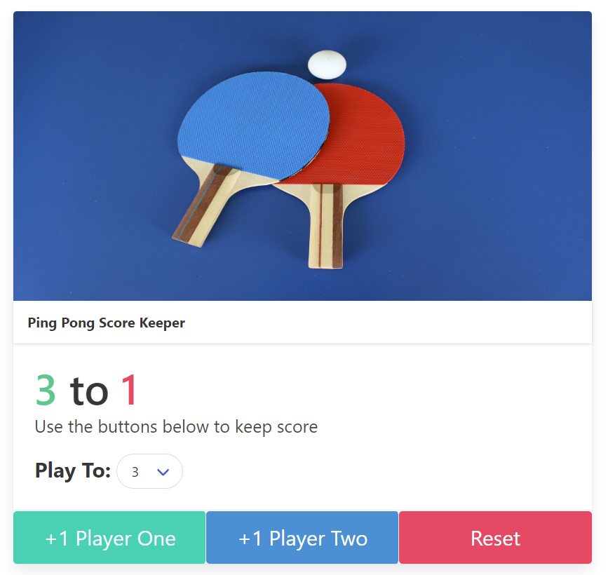

# Ping Pong Score Keeper

**Link to project:** https://brianbud.github.io/score-keeper/

## How It's Made:

**Tech used:** HTML, Bulma(CSS Framework), JavaScript

I first started with the HTML and made sure it had the minumum required:

- display score
- 2 buttons for 2 players
- 1 reset button
- dropdown selections of winning scores

for the JS section:
I selected each element by using document.querySelector('#idName') and assigned to a variable.
In order to manipulate these elements, I used the method addEventListener() and create a function to call when clicked.
The function is an simple increment of +1 every time I clicked the button and to display the change.
I created a condition where the function doesn't run when a player hit the winning score selected and if the game is over is true.
I also add a function when clicking on the reset button to change the value and display to 0 again.
Reset will also occur when user changes the winning score.

for the styling:

This is my first time using a CSS framework called Bulma.
I used a Card component, changed the layout and got to learn more about grid layouts.
I had to refactor some of the HTML code to match the Bulma format.

## Optimizations

I will make sure to come back soon and refactor some repetitive functions.

## Lessons Learned:

I would like to improve on my CSS Skills, but this is my first time seeing how useful a CSS framework like Bulma can be.
In the future, I would like to play around with other CSS Frameworks like Bootstrap and Tailwind since they are well liked in the community.

I learned the difference between using innerHtml, innerText, and textContent.

I was surprised that when using Bulma, I didn't need to create a CSS file but instead add classes in the HTML file to make styling changes. Bulma's documentation was easy to read and understand which was very helpful.
